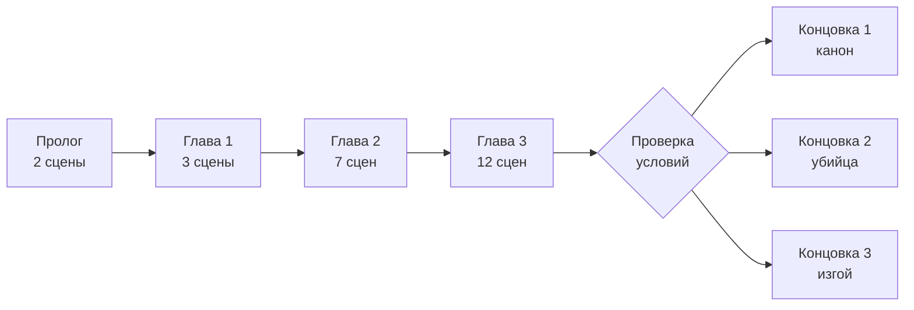
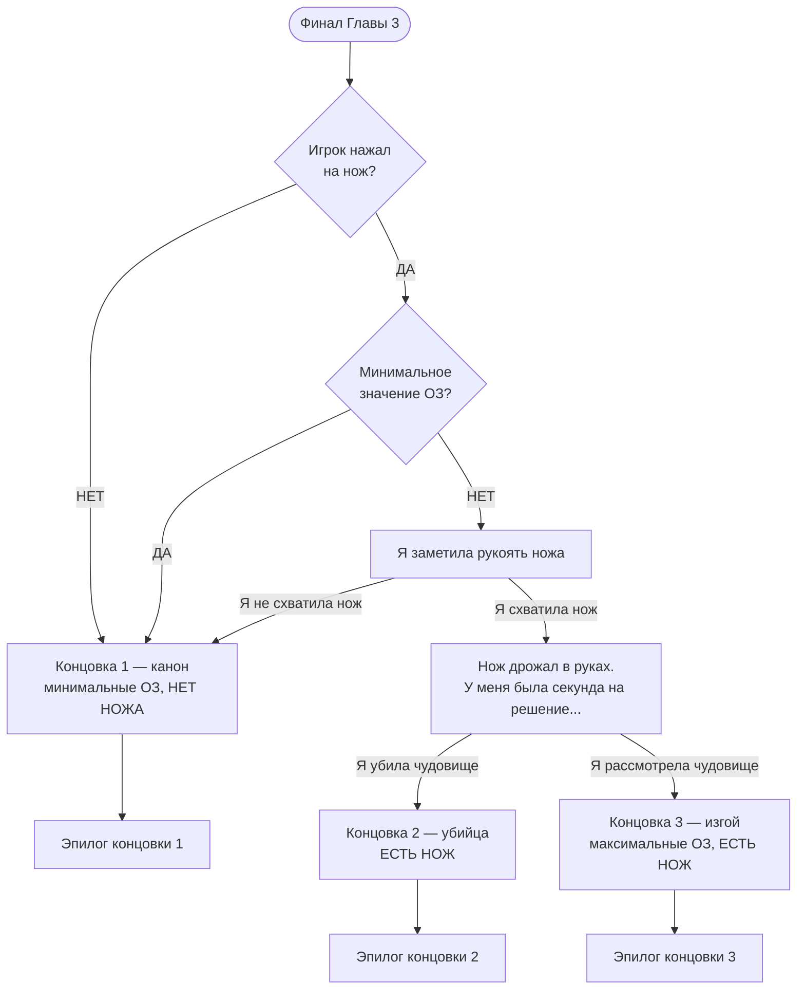

# Структура новеллы «Шаркающий человек»

> Статус: базовая структура, без детализации сцен.

## Оформление документа

Визуальное представление переходов между сценами и ветвлений сценария оформляется в виде Mermaid-диаграмм (блоки `mermaid`) рядом с описанием соответствующих глав/сцен. Для просмотра диаграмм в VS Code — плагин [Markdown Preview Mermaid Support](https://marketplace.visualstudio.com/items?itemName=bierner.markdown-mermaid).

## Общий ход повествования

Основная линия линейна: Пролог → Глава 1 → Глава 2 → Глава 3 → проверка условий → одна из трёх концовок с эпилогом.

## Пролог

- Сцена 1
- Сцена 2

## Глава 1

- Сцена 1
- Сцена 2
- Сцена 3 (Воображаемый друг)

## Глава 2

- Сцена 1 (Полли)
- Сцена 2 (Знакомство с Шаркающим Человеком)
- Сцена 3 (Поездка домой)
- Сцена 4 (Появление котёнка)
- Сцена 5 (Жизнь с котёнком)
- Сцена 6 (Пропажа котёнка)
- Сцена 7 (Побег)

## Глава 3

- Сцена 1 (После бури)
- Сцена 2 (Хочешь апельсинов?)
- Сцена 3 (В телефоне)
- Сцена 4 (Быт не спасёт)
- Сцена 5 (Вот как он умер)
- Сцена 6 (Я не психопатка)
- Сцена 7 (Я не психопатка, но...)
- Сцена 8 (Следы присутствия)
- Сцена 9 (Это он!)
- Сцена 10 (Даркрум)
- Сцена 11 (Свет гаснет)
- Сцена 12 (Шаркающий человек)

## Концовки

Выбор концовки зависит от двух факторов: взял ли игрок нож и значения ОЗ (Очки Здоровья).

### Предварительная проверка условий

1. Игрок нажал на нож?
   - НЕТ → игнорирование логики, выход на концовку 1.
   - ДА → далее.
2. У игрока минимальное значение ОЗ?
   - ДА → выход на концовку 1.
   - НЕТ → «Я заметила рукоять ножа»:
     - Я не схватила нож → выход на концовку 1.
     - Я схватила нож → выход на концовку 2 или 3.

### Перед концовкой 2 или 3 (ЕСТЬ НОЖ)

«Нож дрожал в руках. У меня была секунда на решение...»

- Я убила чудовище → Концовка 2 — убийца (ЕСТЬ НОЖ).
- Я рассмотрела чудовище → Концовка 3 — изгой (максимальные ОЗ, ЕСТЬ НОЖ).

### Список концовок

- Концовка 1 — канон (минимальные ОЗ, НЕТ НОЖА) + эпилог.
- Концовка 2 — убийца (ЕСТЬ НОЖ) + эпилог.
- Концовка 3 — изгой (максимальные ОЗ, ЕСТЬ НОЖ) + эпилог.
